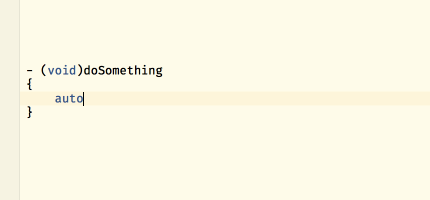
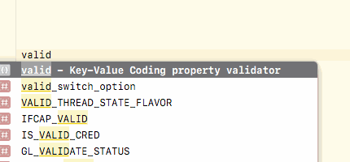
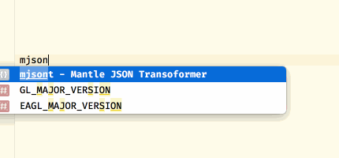

# Xcode Snippets

This repository contains collection of Xcode snippets we use daily at FlixBus.

## Installation

1. Clone the repository.
2. Symlink it to `~/Library/Developer/Xcode/UserData/CodeSnippets`: `ln -s <clone path> ~/Library/Developer/Xcode/UserData/CodeSnippets`.

## __auto_type

This snippet works around lack of autocompletion of `__auto_type` keyword in Xcode 8+.

Shortcut: `auto`.

## kvc-property-validator

This snippet generates KVC property validator methods.

Shortcut: `valid`

## mantle-json-transformer

This snippet generates boilerplate for Mantle JSON transformer methods.

Shortcut: `mjsont`.

